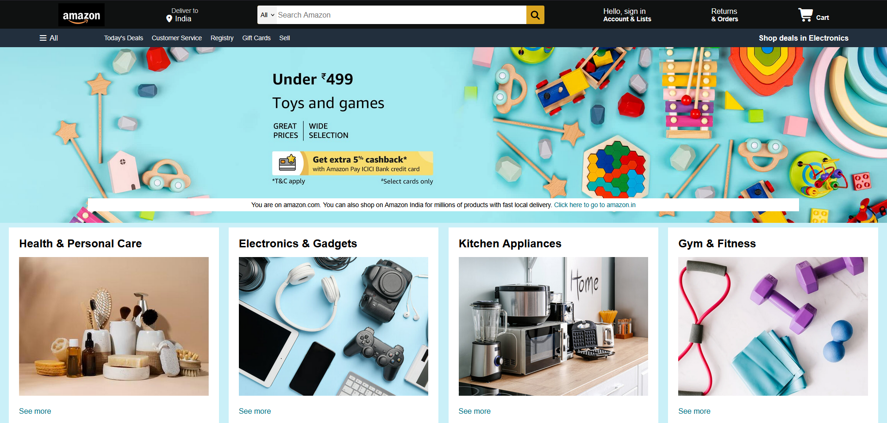
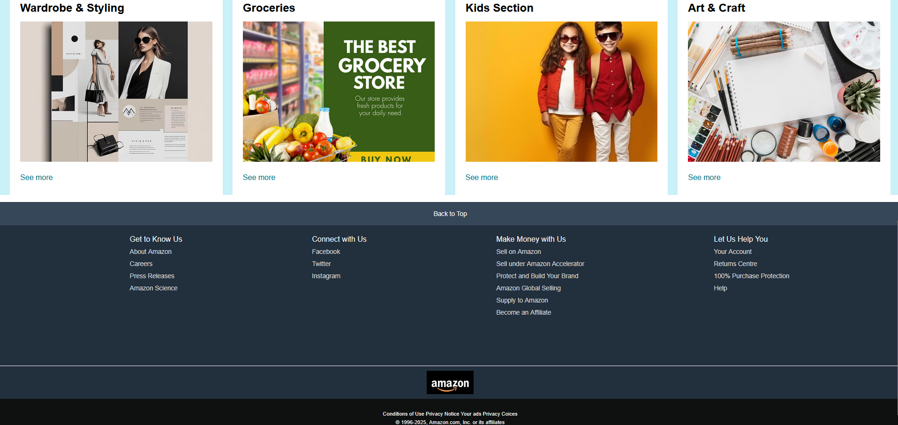

# Amazon Homepage Clone

A static clone of the Amazon homepage built using **HTML and CSS** to practice real-world UI layout and styling.

## Tech Stack
- HTML
- CSS

## Features
- Amazon-style navbar and footer
- Product category cards
- Responsive layout (basic)
- Pixel-inspired UI design

## Author
Harsh Waghela

## 📸 Project Screenshots

### Homepage View

### Section View

